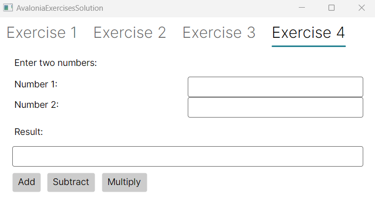

# Avalonia Introduction

## Exercise 1

### Task
- Examine the code for the "Exercise 1" tab in the `MainWindow.axaml`. Run the application and observe the output.
- Modify the grid to have 3 rows and 2 columns. 
- Change the colors of the 2 new rectangles.

## Exercise 2

### Task
- Examine the code for the "Exercise 2" tab in the `MainWindow.axaml`. Run the application and observe the output.
- Add a CheckBox to the StackPanel above the Button.
- Modify the code for `Exercise2ShowOutput_Click` in the `MainWindow.axaml.cs` as follows:
  - When the `Show Output` button is clicked, include the CheckBox's checked state in the output.

## Exercise 3

### Task
- Examine the code for the "Exercise 3" tab in the `MainWindow.axaml`. Run the application and observe the output.
- Add 2 `RadioButtons` Dog and Bird above the `Show Image` button.
- Modify the handler in `Exercise3ShowImage_Click` in the `MainWindow.axaml.cs` to:
  - Display the dog and bird images placed in `Assets` folder when selecting the respective radio buttons.

## Exercise 4

### Task
- Add a new `TabItem` called "Exercise 4" in `MainWindow.axaml`.
- Create the layout as shown below using different layout components, i.e., stack layout, grid layout, etc.
  
- Add handlers for `Add`, `Subtract`, and `Multiply` buttons in `MainWindow.axml.cs`. 
  - It should display addition, subtraction and multiplication of two numbers in the `Result` TextBlock.
- Execute the code and observe output.