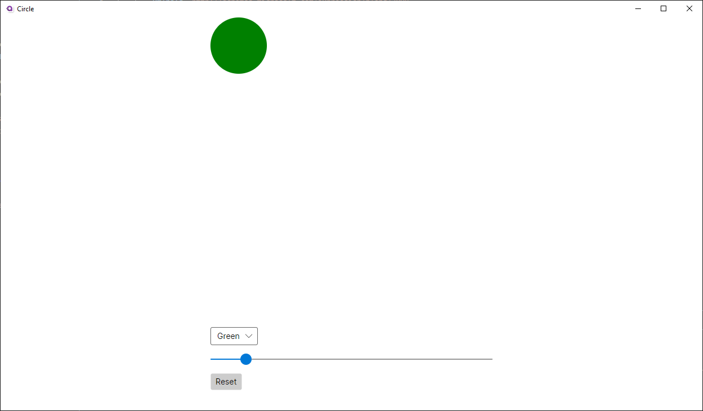

## Problem 2 (20 Points)
You are given a basic Avalonia project *Circle* that has some functionality implemented but currently has no user interface. The goal of this application is to allow a user to change the size and color of a circle. Follow the requirements below and create the user interface.

**The ViewModel is already provided to you. You are only allowed to edit the \Circle\Views\MainWindow.axaml file. Do not change the ViewModel or the CodeBehind.**

Create an UI considering the following requirements:

1. An area for displaying the circle and the Circle itself. **(2 Points)**

2. Add a slider and a combo box to modify the size and the color of the circle respectively. The combo box items must be tied to the list of colors in the ViewModel. Do not hardcode the colors. **(12 Points)**

3. The circle should have a maximum size of 500 and minimum size of 50. Make sure that changing the circle's size does not change any other parts of the UI. **(2 Points)**

4. Create a reset button, that returns the circle to its initial state. **(4 Points)**

*Here is an example of what your UI might look like:*

