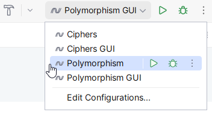

# Polymorphism

## Tasks - Inheritance, Interface and Polymorphism
Your assignment is to implement the following class diagram:


Supplied code:
- IShapeInterface.cs
- AbstractShape.cs
- ShapeDriver.cs


### Task a - Ellipse and Rectangle

1. Create a subclass `Ellipse.cs` as follows: `public class Ellipse : AbstractShape`
2. Declare 2 instance variables of type `double`
3. Create a constructor to initialise these variables
4. Implement methods `GetArea()` and `GetCircumference()` using the formula below.
   
Similarly do it for Rectangle as well.

5. Create a subclass `Rectangle.cs` as follows: `public class Rectangle : AbstractShape`
6. Declare 2 instance variables of type `double`
7. Create a constructor to initialise these variables
8. Implement methods `GetArea()` and `GetCircumference()` using the formula below.

The following formulas can be used to calculate `GetArea()` and `GetCircumference()`:

|               | Ellipse                                            | Rectangle       |
|---------------|----------------------------------------------------|-----------------|
| Area          | _π * r1 * r2_                                      | _l1 * l2_       |
| Circumference | _2 * π * √(½ * (r1<sup>2</sup> + r2<sup>2</sup>))_ | _2 * (l1 + l2)_ |
***Hint:*** Remember you have access to `Pi` from `AbstractShape`. 
You can use `Math.Sqrt()` and `Math.Pow()` for the mathematical expressions.

### Task b - Circle and Square

Create a subclass Circle.cs as follows: `public class Circle : Ellipse`
Create a subclass Square.cs as follows: `public class Square : Rectangle`

Remember that Circles and squares are just Ellipses and Rectangles with r1=r2 and l1=l2 respectively.

***Hint:*** Remember that you can call the parent constructor using ` : base(...)`.

E.g.: `public Circle(double r1) : base(r1, r1) {}`

### Task c - Testing your implementation
Two run configurations have been created for you to test your program.
For testing the implementation, choose the one without "GUI". For testing your Avalonia GUI, choose the one with "GUI".
The run configuration can be seen below:



If this is not available, you can run the respective configurations with the following commands:
```
dotnet run
dotnet run GUI
```

When `ShapeDriver` is executed the output must look like the following:
```
Circle:          Area:  36,317   Circumference: 21,363
Rectangle:       Area:  14,960   Circumference: 15,600
Ellipse:         Area:  28,840   Circumference: 19,289
Square:          Area:  11,560   Circumference: 13,600
```

### Task d - GUI and Singleton Facade
In this task, you’ll work with the following class:
- ShapeFacade.cs

This is the only class we will access from the GUI. The Singleton pattern is a design pattern, ensuring only 1
instance of the class exists. This instance can be accessed through the `GetInstance` method.

To distinguish between the 4 concrete instances of Shapes, the class contains the following enum:
```csharp
public enum Shapes {
    Ellipse, Rectangle, Circle, Square
};
```

`Shapes`  can be accessed statically through other classes (example: `ShapeFacade.Shapes.Circle`).

### Task e - GetShapeInfo() method

Implement the following method depending on the shape it receives, it should take either 1 or 2
parameters of the double type, as follows
```csharp
public string GetShapeInfo(Shapes shape, params double[] p)
{
    throw new NotImplementedException("Not implemented!");
}
```

- Create a switch depending on the type of shape:  `Ellipse`, `Rectangle`, `Circle`, `Square`.
- These shapes should then be created with the parameters the method receives.
- If the case is either `Circle` or `Square`, it should take the 1st double param passed to the method to construct the shape.
- If the case is `Ellipse` or `Rectangle`, it should take the 1st and 2nd double param passed to the method to construct the shape.
- The method should return the shape's toString() string.

### Task f - Implement the GUI
**Note:** Remember to choose the run configuration named **GUI** at the end.

Locate the `MainWindow.axaml` file.
The final GUI is supposed to look like the following screenshots:


A `Grid` has already been defined, to help you set up the GUI, feel free to use it or change it however you like.

The UI should consist of:
- __4__ `RadioButton` for choosing the Shape.
- __2__ `TextBox` for parameters. Only one is visible if Circle or Square has been selected.
- __1__ `TextBlock` for results.
- __1__ `Button` "**Get Info**" for calling the facade.

Implement a handler for the 4 `RadioButton`, to ensure one or both `TextBox` are visible.

**Hint**: In the constructor of the `MainWindow.axaml.cs` file the radiobuttons have been given the enum-values from the Facade. i.e. 
`RadioEllipse.Content = ShapeFacade.Shapes.Ellipse;`
***Remember to uncomment the code and to name the radiobuttons accordingly.***

***Hint***: The value of the selected `RadioButton` can be accessed with: `(ShapeFacade.Shapes)(sender as RadioButton).Content`. 
For instance, it could be used with a local variable and a Handler looking like this:
```csharp
ShapeFacade.Shapes _selectedShape;
private void RadioButtonHandler(object? sender, RoutedEventArgs e)
{
    _selectedShape = (ShapeFacade.Shapes)(sender as RadioButton).Content
}
```

If the Shape is  Circle or Square, then 1 `TextBox` should be visible and if the shape is Ellipse or Rectangle, 2 `TextBox` should be visible.

Implement a handler on the Get Info-button, so that the facade is called by:
- `ShapeFacade.GetInstance.GetShapeInfo(shape, p);` (Circle/Square) or
- `ShapeFacade.GetInstance.GetShapeInfo(shape, p1, p2);` (Ellipse/Rectangle)

The result is then printed out in the `TextBlock`.
