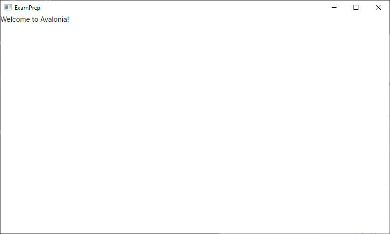
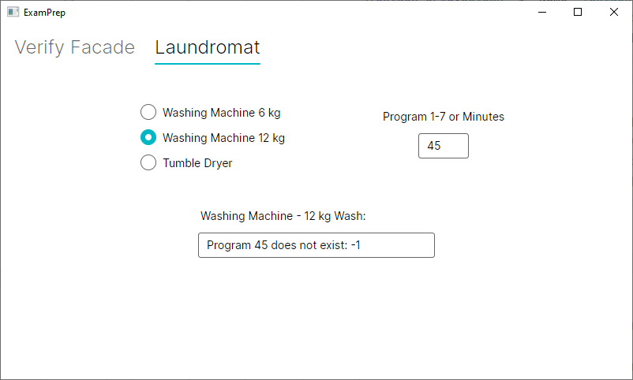

# Exercises for Lecture 12

## Task 1 - Creating an Avalonia project

**Hints can be found at the end of this README**

__Purpose__: To create an exam project as an Avalonia project, correctly named and prepared for the following tasks.

Open Rider and select the Avalonia .NET App template.

Use the following parameters:

- Language: **C#**
- Target framework: **We recommend (net9.0)**

Fill out name and location appropriately.


Rider will initialize the project.

(You may wish to go into `App.axaml` and change  `RequestedThemeVariant` to "Light", 
as well as defining a `Width=""` `Height=""`  in the `MainWindow.axaml` file.)

Verify that everything is working by opening and executing the "Program.cs" file.
This should prompt the following window:



You are now ready to continue with the following exercises😁.

## Task 2 - Facade-pattern and some basic C#

**Purpose**: To implement a Facade-pattern class, that the GUI layer is able to utilize.

### Task 2.0

1. Implement a class `Facade.cs` in a folder called `facade`
2. Create a variable `int[] IntArray` within the class (Remember proper encapsulation)
3. Create a variable of type `System.Random`
4. Initialize the `Random` variable in the constructor. The constructor should be parameterless.
5. Create a "getter" property for the `IntArray;`

_In the following three subtasks, you'll program three algorithms that utilizes arrays, loops and conditionals._

### Task 2.1 - `public int[] FillArray(int size,int max)`

Implement the method, so it:
 - Initializes `IntArray` to the size of `size` 
 - Fills it with random numbers in the interval `(0, max)`
 - Returns the array

### Task 2.2 - `public int SumOfDivisors(int divisor)`

Implement the method, so it returns the sum of the numbers within the `IntArray` variable that is divisible by
the `divisor` argument (Hint 1).

### Task 2.3 - `public int[] FillUniqueArray(int size, int max)`

Implement the method, so it:
 - Initializes `IntArray` to the size of the argument `size`
 - Fills it with random unique numbers within the `(0, max)` interval.
   - Unique meaning that each number is only allowed to appear once.
     - > **Hint 2**
 - Sorts the array
 - Returns the array

Ensure that `size <= max` and no numbers are repeated.
> **Hint 3**

### Task 2.4 - Testing your implementation
Testing your implementation can be a little difficult, since the entrypoint is set to the Avalonia instance.
However, for a quick and dirty testing without too much configuration you can do the following:
1. Implement a method to test your implementation within your `Facade.cs` class. 
   1. Give it the signature `public static void TestFacadeOutput()`.
   2. Write your code to test the implementation, i.e. create an instance of the `Facade` and call the different methods you wish to test.
      1. For printing an array you can use ` string.Join()`, i.e.: `Console.WriteLine("FillArray: " + string.Join(", ", facade.FillArray(20, 10)));`
2. Go into `Program.cs` and change the `Main`-method. It will most likely look like this:
```csharp
[STAThread]
public static void Main(string[] args) => BuildAvaloniaApp()
    .StartWithClassicDesktopLifetime(args);
```
Change it to the following, which will then call your `TestFacadeOutput()`-method upon running the ExamPrep project:
```csharp
[STAThread]
public static void Main(string[] args)
{
    BuildAvaloniaApp().StartWithClassicDesktopLifetime(args);
    facade.Facade.TestFacadeOutput();
}
```
**Note:** This will first launch the Avalonia GUI window and once that has been closed, the `TestFacadeOutput()` 
will be executed.
Feel free to comment out the line starting with `BuildAvaloniaApp()` to avoid having to close the GUI.
However, remember to uncomment it again for the remaining exercises.

**N.B.:** *The above is under the assumption your folder is called `facade` and your class is called `Facade`, 
with a method called `TestFacadeOutput()`*

Example: Execution of your `TestFacadeOutput()`-method could give the following:
```
FillArray: 0, 2, 9, 1, 0, 7, 0, 6, 9, 3, 4, 1, 7, 5, 5, 5, 4, 1, 2, 9
Divisor of 3 has a sum of: 18
FillUniqueArray: 2, 5, 6, 7, 8, 10, 12, 14, 15, 16, 17, 18, 19, 21, 22, 23, 24, 25, 27, 29
```

### Task 2.5 - Calling methods from the GUI layer

1. Create a `TabControl` within your Avalonia file, i.e. `MainWindow.Axaml`. 
2. Within the `TabControl` create a new `TabItem` and set the `Header` to "_Verify Facade_".
3. Declare the `Facade` as a variable and initialize it within the `MainWindow()` constructor.
4. Create components within the Tab, such that the three methods in the Facade class can be called from the UI. You can use
   the UI below as reference.


## Task 3 - Polymorphism and a facade that uses the singleton-pattern

This class diagram shows a simplified structure of a laundromat:


The interface `ILaundryMachine` represents all machines that can be used inside a laundromat (wash, drying, spin drying,
soap-vendor, coffee machine and more.). However, in this task we're solely focusing on washing machines and dryers:

`ILaundryMachine.cs` (supplied code) defines the methods:

| Method                              | Return                                              |
|-------------------------------------|-----------------------------------------------------|
| `string GetModel()`                 | Returns the model of the machine                    |
| `double GetPrice(int program)`      | Returns the price when using the machine            |
| `string GetProgamName(int program)` | Returns a description of a program that can be used |

`TumbleDryer.cs` (supplied code) represents dryers:

- Implements the interface `LaundryMachine` in the class (Hint: how do we normally implement interfaces?)
- The constructor takes a `model` as an argument

| Method                                 | Info                                                       |
|----------------------------------------|------------------------------------------------------------|
| `void SetPrice(double pricePerMinute)` | Sets the minute price when using the machine               |
| `string GetModel()`                    | Returns the model of the machine                           |
| `double GetPrice(int program)`         | Returns the price for a given amount of minutes (program is the amount of minutes).                      |
| `string GetProgamName(int program)`    | Returns for example "Drying for 30 minutes", if prog = 30. |

`WashingMachine.cs` (supplied code) represents washing machines:

- Implements the `LaundryMachine` interface
- The constructor takes a `model` as an argument
- Contains an attribute of the type`Dictionary<int, WashProgram>` : _Contains the programs that are available_.

| Method                                                 | Info                                                                  |
|--------------------------------------------------------|-----------------------------------------------------------------------|
| `void AddProgram(int prog, string name, double price)` | Defines a washing program and puts it into the map with `prog` as key |
| `string GetModel()`                                    | Returns the model of the machine                                      |
| `double GetPrice(int program)`                         | Returns the price of use of program `program`                         |
| `string GetProgName(int program)`                      | Returns the name of the program `prog`                                |

`WashProgram.cs` (supplied code) represents a single wash program including its name and price.

`LaundryConstants.cs` (supplied code) is an abstract record containing model definitions, program names and program prices. 
These constants can be used to create a test laundromat, and also used within the user interface in task 3.2.

`LaundrySingleton.cs` (supplied code) represents a test laundromat, which partially can be run through the `TestLaundrySingleton()`-method and can be
partially used as a _Facade_ within the Avalonia GUI. Only the part that makes this class a singleton isn't implemented.

It contains a method `public void BuildLaundry()`, that creates a laundromat with the values from `LaundryConstants`.

### Task 3.1 - Singleton

__Purpose__: To implement a class, which uses the singleton pattern.

Create code within the `LaundrySingleton.cs`, such that it becomes a singleton class. The singleton pattern dictates
that instance methods only are available through a static method/property, such as
`LaundrySingleton.GetInstance` and that whenever you interact with the class, it is through the same
instance every time.

### Task 3.2 - Implementations of the LaundryMachine interface

__Purpose__: Implementation of polymorphism methods defined within the interface.

Implement the missing code in:

- `TumbleDryer.cs`
- `WashingMachine.cs`

To test the code within the `LaundrySingleton`, you can, just like before, add the `TestLaundrySingleton()`-method 
to the `Main()`-method in `Program.cs`. For instance if it is located in the folder `supplied_code` it would look like:
```csharp
[STAThread]
public static void Main(string[] args)
{
    BuildAvaloniaApp().StartWithClassicDesktopLifetime(args);
    facade.Facade.TestFacadeOutput();
    supplied_code.LaundrySingleton.TestLaundrySingleton();
}
```

When executing the `TestLaundrySingleton()`-method within `LaundrySingleton`, after implementing `TumbleDryer.cs` & 
`WashingMachine.cs` the output should look like so:

```
Washing Machine - Max 6 kg:
40 Non-iron     35,00

Washing Machine - Max 12 kg:
40 Non-iron     52,50

Tumble Dryer:
Drying for 5 minutes    6,25
```

### Task 3.3 - GUI

__Purpose__: Implementation of a simple user interface that uses the `LaundrySingleton` class to make polymorphism calls
to the `LaundryMachine` interface implementations.

Create a new `TabItem` within your user interface (`MainWindow.axaml`) and set the `Header` to "_Laundromat_".

From the UI, it should be possible to test the laundromat. For each of the three machines, generated by
the `LaundrySingleton.BuildLaundry()`, it should be possible to select a program (and pick minutes for the dryer) and
get a price quote:


- Add the line `LaundrySingleton.GetInstance.BuildLaundry();` to the `MainWindow()`-constructor within your 
`MainWindow.axaml.cs` such that the laundromat is available.
- The test user interface contains the following:
    - Three `RadioButton`s that lets the user pick a machine of their choice. 
      - They should all share a common Handler that gets called when they are **clicked**.
    - A `Label` and an accompanying `TextBox` allowing the user to enter the program number or the drying time.
      - This `TextBox` should share the same Handler as the `RadioButton`'s.
    - A `TextBox` that shows the selected program and price.
    - A `Label` that shows the selected Machine name above the program and price
    - When a washing machine is selected, use the program name and the price methods defined in `LaundrySingleton`.
      - **Hint 4** 

The following three examples show a possible solution to the UI (in the last example the value -1 is used as an
error code when a program is missing):


> Program 3 selected on machine 0.


> 45 minutes of drying selected on machine 2.


> Non-existent program 45 selected on machine 1.

# HINTS
**Hint 1** `x % divisor == 0`

**Hint 2**: You can use a `ISet` when generating the numbers. When the set has the desired size, you can fill in an array with values from the set. 
Alternatively you can also create helper function to handle this.

**Hint 3**: throw an `ArgumentException` if the size is greater than max.

**Hint 4**: Remember that they can be called by e.g. `LaundrySingleton.GetInstance.GetProgramName()`